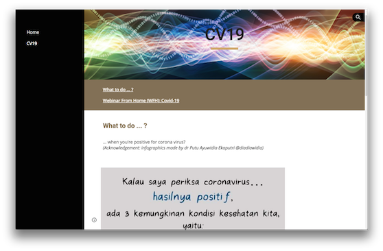

WFH
=================

***WFH Documentation***

**Author:** *Irwan Prasetya Gunawan*

Daily activities log during WFH period.
&nbsp;

**Table of Content**

- [WFH](#wfh)
  * [WFH Report - Official](#wfh-report---official)
  * [Detailed log](#detailed-log)
- [Day 01 2020-03-16 Mon](#day-01-2020-03-16-mon)
  * [Aktivitas](#aktivitas)
  * [Dokumentasi](#dokumentasi)
  * [Persiapan materi perkuliahan](#persiapan-materi-perkuliahan)
- [Day 02 2020-03-17  Tue](#day-02-2020-03-17--tue)
  * [Aktivitas](#aktivitas-1)
  * [Komunikasi](#komunikasi)
  * [Dokumentasi](#dokumentasi-1)
- [Day 03 2020-03-18  Wed](#day-03-2020-03-18--wed)
  * [Aktivitas](#aktivitas-2)
  * [Dokumentasi](#dokumentasi-2)
- [Day 04 2020-03-19  Thu](#day-04-2020-03-19--thu)
  * [Aktivitas](#aktivitas-3)
  * [Dokumentasi](#dokumentasi-3)
- [Day 05 2020-03-20  Fri](#day-05-2020-03-20--fri)
  * [Aktivitas](#aktivitas-4)
    + [Parsing data mentah dari Google spreadsheet](#parsing-data-mentah-dari-google-spreadsheet)
    + [Integrasi data untuk simulasi](#integrasi-data-untuk-simulasi)
      - [Metode](#metode)
      - [Hasil Pengetesan Integrasi Data](#hasil-pengetesan-integrasi-data)
  * [Dokumentasi](#dokumentasi-4)
- [Day 06 2020-03-21  Sat](#day-06-2020-03-21--sat)
  * [Aktivitas](#aktivitas-5)
    + [Penambahan timestamp](#penambahan-timestamp)
  * [Dokumentasi](#dokumentasi-5)
- [Day 07 2020-03-22  Sun](#day-07-2020-03-22--sun)
  * [Aktivitas](#aktivitas-6)
    + [E-learning kampus](#e-learning-kampus)
  * [Dokumentasi](#dokumentasi-6)
- [Day 08 2020-03-23  Mon](#day-08-2020-03-23--mon)
  * [Aktivitas](#aktivitas-7)
  * [Dokumentasi](#dokumentasi-7)
- [Day 09 2020-03-24  Tue](#day-09-2020-03-24--tue)
  * [Aktivitas](#aktivitas-8)
  * [Dokumentasi](#dokumentasi-8)
- [Day 10 2020-03-25  Wed](#day-10-2020-03-25--wed)
  * [Aktivitas](#aktivitas-9)
      - [Video panduan](#video-panduan)
      - [Pembuatan Video panduan](#pembuatan-video-panduan)
      - [Website](#website)
  * [Dokumentasi](#dokumentasi-9)
- [Day 11 2020-03-26  Thu](#day-11-2020-03-26--thu)
  * [Aktivitas](#aktivitas-10)
  * [Dokumentasi](#dokumentasi-10)
- [Day 12 2020-03-27  Fri](#day-12-2020-03-27--fri)
  * [Aktivitas](#aktivitas-11)
    + [Laman sosialisasi corona virus](#laman-sosialisasi-corona-virus)
  * [Dokumentasi](#dokumentasi-11)
- [Day 15 2020-03-30  Mon](#day-15-2020-03-30--mon)
  * [Aktivitas](#aktivitas-12)
  * [Dokumentasi](#dokumentasi-12)
- [Day 16 2020-03-31  Tue](#day-16-2020-03-31--tue)
  * [Aktivitas](#aktivitas-13)
  * [Dokumentasi](#dokumentasi-13)
- [Day 17 2020-04-01  Wed](#day-17-2020-04-01--wed)
  * [Aktivitas](#aktivitas-14)
  * [Dokumentasi](#dokumentasi-14)
- [Day 18 2020-04-02  Thu](#day-18-2020-04-02--thu)
  * [Aktivitas](#aktivitas-15)
  * [Dokumentasi](#dokumentasi-15)
- [Day 19 2020-04-03  Fri](#day-19-2020-04-03--fri)
  * [Aktivitas](#aktivitas-16)
  * [Dokumentasi:](#dokumentasi-)
- [Day 20 2020-04-04  Sat](#day-20-2020-04-04--sat)
  * [Aktivitas](#aktivitas-17)
  * [Dokumentasi](#dokumentasi-16)
- [Day 21 2020-04-05  Sun](#day-21-2020-04-05--sun)
  * [Aktivitas](#aktivitas-18)
  * [Dokumentasi](#dokumentasi-17)
- [Day 22 2020-04-06  Mon](#day-22-2020-04-06--mon)
  * [Aktivitas](#aktivitas-19)
    + [Perkuliahan - Calculus 2](#perkuliahan---calculus-2)
    + [Perkuliahan - Discrete Math](#perkuliahan---discrete-math)
    + [Notes](#notes)
  * [Dokumentasi](#dokumentasi-18)
- [Day 23 2020-04-07 Tue](#day-23-2020-04-07-tue)
  * [Aktivitas](#aktivitas-20)
    + [Penelitian](#penelitian)
    + [Lain-lain](#lain-lain)
    + [Notes](#notes-1)
  * [Dokumentasi](#dokumentasi-19)
- [Day 24 2020-04-08 Wed](#day-24-2020-04-08-wed)
  * [Aktivitas](#aktivitas-21)
    + [Perkuliahan DSP](#perkuliahan-dsp)
    + [Notes](#notes-2)
  * [Dokumentasi](#dokumentasi-20)
- [Day 25 2020-04-09 Thu](#day-25-2020-04-09-thu)
  * [Aktivitas](#aktivitas-22)
    + [Perkuliahan - Komunikasi Nirkabel](#perkuliahan---komunikasi-nirkabel)
    + [Lain-lain](#lain-lain-1)
    + [Notes](#notes-3)
  * [Dokumentasi](#dokumentasi-21)
- [Day 26 2020-04-10 Fri](#day-26-2020-04-10-fri)
  * [Aktivitas](#aktivitas-23)
 

<small><i><a href='http://ecotrust-canada.github.io/markdown-toc/'>Table of contents generated with markdown-toc</a></i></small>

&nbsp;

## WFH Report - Official

Official Reports are updated/uploaded on each submission period:

- Session 06 Week of 20200405: Read/download the report [here](https://github.com/ipguna/WFH/blob/master/report/F-SDM-22-IPG-20200405rev.pdf)
- Session 07 Week of 20200412: Read/download the report [here](https://github.com/ipguna/WFH/blob/master/report/F-SDM-22-IPG-20200412.pdf)
- Session 07 Week of 20200419: Read/download the report [here](https://github.com/ipguna/WFH/blob/master/report/F-SDM-22-IPG-20200419.pdf)
- Session 07 Week of 20200426: Read/download the report [here](https://github.com/ipguna/WFH/blob/master/report/F-SDM-22-IPG-20200426.pdf)
- Session 08 Week of 20200503: Read/download the report [here](https://github.com/ipguna/WFH/blob/master/report/F-SDM-22-IPG-20200503.pdf)
- Session 09 Week of 20200510: Read/download the report [here](https://github.com/ipguna/WFH/blob/master/report/F-SDM-22-IPG-20200510.pdf)
- Session 10 Week of 20200517: Read/download the report [here](https://github.com/ipguna/WFH/blob/master/report/F-SDM-22-IPG-20200517.pdf)
- Session 11 Week of 20200614: Read/download the report [here](https://github.com/ipguna/WFH/blob/master/report/F-SDM-22-IPG-20200614.pdf)
- Session 12 Week of 20200621: Read/download the report [here](https://github.com/ipguna/WFH/blob/master/report/F-SDM-22-IPG-20200621.pdf)

## Detailed log

Versi detail dari laporan mingguan/harian tapi bersifat _unofficial_ dan _unstructured_ bisa dibaca di halaman ini. Halaman ini menyediakan lebih lengkap detil dokumentasi pendukung serta deskripsi pekerjaan.

_Notes: dokumen pendukung (screenshots) bisa diakses melalui link yang tersedia pada judul catatan harian masing-masing, atau melalui link pada dokumen lainnya._

# Day 01 2020-03-16 Mon

[Day 01 : 2020-03-16 (Mon)](https://github.com/ipguna/WFH/tree/master/log/2020-03-16)

## Aktivitas

- Persiapan materi perkuliahan Kalkulus 2 (jadwal reguler 07:30-09.00)
- Persiapan materi perkuliahan Matematika Diskret (jadwal reguler 10.00-12.40)
- Penulisan [dokumen panduan](https://github.com/ipguna/TIF-RPS2020/blob/master/Teaching_Supervision_Guide_01.pdf) perkuliahan secara daring untuk mahasiswa

## Dokumentasi

- [Screenshot aktivitas](https://github.com/ipguna/WFH/tree/master/log/2020-03-16)

## Persiapan materi perkuliahan

- Pembuatan dan upload slide materi ke elearning moodle BIG 2.0
- Penyajian tugas/latihan online
- Setting up chat online dan forum diskusi pada Moodle di BIG 2.0.

Back to [TOP](#wfh)

# Day 02 2020-03-17  Tue 

[Day 02 : 2020-03-17 (Tue)](https://github.com/ipguna/WFH/tree/master/log/2020-03-17)

## Aktivitas

- Persiapan materi perkuliahan DSP (untuk jadwal reguler hari Rabu pkl. 07:30-10.00)
- Update dokumen panduan perkuliahan secara daring untuk mahasiswa
- Komunikasi (ref. email) kepada Kabiro HRD dan Kabiro IT mengenai saran dan masukan petunjuk pelaksanaan pembelajaran daring

## Komunikasi

Pemberian rekomendasi pembuatan panduan perkuliahan daring (Referensi: email to Kabiro HRD dan Kabiro IT)

- Menyediakan page khusus dari domain UB atau sub-page BTI berisi panduan/petunjuk pelaksanaan persiapan dan pelaksanaan pembelajaran daring

- Alternatif penempatan page petunjuk
    + https://bakrie.ac.id/jakun
    + https://www.bakrie.ac.id/en/online-class-preparation/
    + https://www.bakrie.ac.id/en/bti/online-class-preparation/

- Saran _to do list_ update [dokumen panduan perkuliahan daring](https://github.com/ipguna/TIF-RPS2020/blob/master/Teaching_Supervision_Guide_01.pdf)

    + Petunjuk cara student menjawab/mensubmit hasil kerjaan/jawaban/tugas mahasiswa.
    + Petunjuk untuk membuat materi online berbasis ‘Lesson’ pada moodle yang seharusnya menjadi prioritas utama utk dosen tetap UB dengan pertimbangan bahwa kemampuan fasilitas/tools di BIG 2.0 sebenarnya lebih dari cukup untuk kebutuhan online course saat ini. Hanya tinggal bagaimana cara kita bisa memanfaatkannya saja
    + Tambahan: panduan set up _online learning course_ di platform lain selain BIG 2.0 (spt Google classroom, webex, dsb), terutama jika misalnya dosen akan mengadakan kelas berbasis conference (Skenario 3 - Advanced).

Contoh panduan platform non-BIG 2.0:

- Panduan membuat materi via Webex: https://drive.google.com/file/d/1A3TbXG4MNXbNhMIHS9eyXxGLWcDP2o7l/view?usp=sharing
- Panduan conference menggunakan Jitsi Meet:  https://www.youtube.com/watch?v=6pJRWI9eZgo
- Panduan Google Classroom / Google Hangout: https://www.youtube.com/watch?v=ZeACf_Slsb8

## Dokumentasi

- [Screenshot aktivitas](https://github.com/ipguna/WFH/tree/master/log/2020-03-17)

Back to [TOP](#wfh)

# Day 03 2020-03-18  Wed 
 
 [Day 03 : 2020-03-18 (Wed)](https://github.com/ipguna/WFH/tree/master/log/2020-03-18)

## Aktivitas

- Update dokumen panduan perkuliahan secara daring untuk mahasiswa
- Explorasi - simulasi penyebaran pasien nCovid-19 menggunakan python

    Source code dan hasil simulasi bisa dilihat pada https://github.com/ipguna/CV19

    Explorasi simulasi ini dilakukan karena berdasarkan rujukan paper yang digunakan \[1\], model matematika penyebaran kasus nCovid-19 ini merupakan solusi dari persamaan diferensial orde pertama. Akan dilihat apakah persamaan matematika pada kasus ini bisa diterapkan untuk materi kuliah Kalkulus 2.

    Referensi:

    \[1\]. Nuraini, Nuning and Khairudin, Kamal and Apri, Mochamad. "Data dan Simulasi COVID-19 dipandang dari Pendekatan Model Matematika". Preprint. (Submitted) http://eprints.itb.ac.id/119/

## Dokumentasi

- [Screenshot aktivitas](https://github.com/ipguna/WFH/tree/master/log/2020-03-18)

Back to [TOP](#wfh)

# Day 04 2020-03-19  Thu 

[Day 04 : 2020-03-19 (Thu)](https://github.com/ipguna/WFH/tree/master/log/2020-03-19)

## Aktivitas

- Penyajian online materi perkuliahan Komunikasi Nirkabel (untuk jadwal reguler hari Kamis pkl. 10.10-12.40 WIB)
- Update dokumen panduan perkuliahan secara daring untuk mahasiswa
- Continued: simulasi model matematika penyebaran kasus Covid-19 dengan python
    +   Tampilan results hasil simulasi pada console/terminal
    +   TODO: menyimpan results hasil simulasi dalam bentuk datafile dengan format csv
    +   TODO: otomatisasi pembacaan/parsing data mentah dari web \[DONE - Updated [Day 05 : 2020-03-20 (Fri)](#day-05--2020-03-20-fri)\]

## Dokumentasi

- [Screenshot aktivitas](https://github.com/ipguna/WFH/tree/master/log/2020-03-19)

Back to [TOP](#wfh)

# Day 05 2020-03-20  Fri 

[Day 05 : 2020-03-20 (Fri)](https://github.com/ipguna/WFH/tree/master/log/2020-03-20)

## Aktivitas

- Update dokumen RPS (_still in progress_)
- Continued: simulasi model matematika penyebaran kasus Covid-19 dengan python
    +   [Otomatisasi](#parsing-data-mentah-dari-google-spreadsheet) pembacaan/parsing data mentah dari web
    +   [Integrasi](#integrasi-data-untuk-simulasi) data mentah dari Google spreadsheet ke dalam simulasi
    <!-- +   Penambahan [timestamp](#penambahan-timestamp) pada file data yang disimpan -->

### Parsing data mentah dari Google spreadsheet

Cara/metode parsing data Google spreadsheet menggunakan API
(_application program interface_) berbasis python:

- Referensi

    https://medium.com/analytics-vidhya/how-to-read-and-write-data-to-google-spreadsheet-using-python-ebf54d51a72c

- Data CORVID-19 (dari Google Sheet)

    Google sheet URL
    https://docs.google.com/spreadsheets/u/1/d/1ma1T9hWbec1pXlwZ89WakRk-OfVUQZsOCFl4FwZxzVw/htmlview?usp=sharing#

- Google Sheet ID:

        1ma1T9hWbec1pXlwZ89WakRk-OfVUQZsOCFl4FwZxzVw

- Mengaktifkan (_enable_) Google sheet API.

    https://developers.google.com/sheets/api/quickstart/python

    + Aktivasi Google Sheet API (mengeklik button 'Enable the Google Sheet API')

    + Client ID

            789169786057-6fu0hma68l17bf2rs3nt5h5g8sg9e3jf.apps.googleusercontent.com

    + Client Secret

            g2L5B_KNTtDut7pBfh-8a3P5

- Result : error pada saat compile program testing

        pkg_resources.ContextualVersionConflict: (requests 2.14.2
        (/Users/irwan/anaconda/lib/python3.5/site-packages),
        Requirement.parse('requests<3.0.0dev,>=2.18.0'), {'google-api-core'})

    Error ini terjadi karena ternyata pada saat pertama kali dicompile, dibutuhkan
    proses authentikasi ke Google API. Setelah dilakukan proses authentikasi ini,
    maka proses pembacaan data mentah secara langsung ke object data DataFrame
    bisa dilakukan dengan sukses.

- Python code untuk proses testing pembacaan data

        cv19gtest.py

    Code ini diambil sepenuhnya dari referensi metode parsing di atas,
    dengan mengubah parameter-parameter Sheet ID, range cell dan json file
    sesuai dengan yang dibutuhkan.

### Integrasi data untuk simulasi

Dari proses yang sudah dilakukan di atas, data mentah dari Google
spreadsheet telah berhasil dibaca dan disimpan dalam object DataFrame.
Langkah berikutnya adalah membaca / menggunakan data ini dalam proses
simulasi matematis dan visualisasi berikutnya.

#### Metode

Ada beberapa alternatif metode yang bisa dilakukan:

1. **Cara 1:** Menyalin secara langsung data dari DataFrame yang sudah dibaca ke dalam
dataframe yang baru; untuk melakukan hal ini, ada beberapa hal yang mesti
dilakukan:
    - Mengetahui nama field/kolom dari spreadsheet
    - Mengubah nama field/kolom
    - Menyimpan/menyalin data kedalam dataframe baru (dengan proses clean up data)

    Ketiga langkah ini perlu dilakukan agar data yang sudah di-_clean up_ ini
siap dibaca untuk langkah berikutnya (simulasi matematis dan visualisasi
hasil).

2. **Cara 2:** Menyimpan data dari DataFrame yang sudah dibaca ke dalam file CSV, kemudian
membaca kembali file CSV yang dibuat tersebut.

    Metode kedua ini cukup _feasible_ untuk ditempuh karena pada simulasi
    pertama yang sudah dilakukan, data dibaca dari file CSV yang disimpan secara lokal.

    _Obvious disadvantage_ dari **Cara 2** ini adalah extra _processing delay_
    karena penulisan dan pembacaan data dari file CSV.

#### Hasil Pengetesan Integrasi Data

Karena simulasi pertama pada source code `cv19sim.py` menggunakan file
CSV, maka akan dicoba terlebih dahulu **Cara 2**. Pada simulasi yang
telah dilakukan pertama kali, pembacaan data CSV memanfaatkan tools/library
`pandas`. Penulisan data dari DataFrame ke CSV file juga akan memanfaatkan
library yang sama.

Pada proses pembacaan data yang dilakukan oleh `cv19gtest.py`, dataframe
dibentuk oleh

    df=pd.DataFrame(values_input[1:], columns=values_input[0])

Maka selanjutnya, tabel pada DataFrame ini bisa langsung disimpan ke dalam
CSV file dengan code berikut:

    df.to_csv('saved_data.csv')

Referensi: https://realpython.com/python-csv/

Pengetesan integrasi data dengan **Cara 2** ini berhasil dilakukan; data
yang dibaca langsung dari Google Spreadsheet bisa disimpan sebagai CSV file
dan file CSV inilah yang kemudian digunakan oleh program simulasi model
matematik yang sudah ada sebelumnya. Oleh karena itu, untuk sementara waktu
metode / **Cara 2** inilah yang akan dilakukan untuk simulasi-simulasi
berikutnya.

## Dokumentasi

- [Day 05 : 2020-03-20 (Fri)](https://github.com/ipguna/WFH/tree/master/log/2020-03-20)

<!-- --------------------------------------------------------- -->
Back to [TOP](#wfh)

# Day 06 2020-03-21  Sat 

## Aktivitas

- Continued: simulasi model matematika penyebaran kasus Covid-19 dengan python
berupa penambahan fitur [timestamp](#penambahan-timestamp) pada file data yang disimpan.

### Penambahan timestamp

Penambahan timestamp untuk menandai kapan data mentah didownload (dan disimpan)
agar bisa dibedakan dengan versi data yang sama namun didownload pada waktu yang
berbeda.

Referensi yang digunakan:
https://thispointer.com/python-how-to-get-current-date-and-time-or-timestamp/

Untuk keperluan ini, kita gunakan modul python `datetime` yang memiliki _class_ `datetime`.
Waktu pada saat ini diambil dengan metode `now()`.

Sebelumnya pengambilan data waktu ini dilakukan, kita harus terlebih dahulu
melakukan _import class_ `datetime` dari modul `datetime` sebagai berikut:

    from datetime import datetime

Berikutnya adalah mengambil data waktu saat ini pada _local timezone_:

    dateTimeObj = datetime.now()

Selanjutnya, timestamp yang kita inginkan bisa kita bentuk dengan mengubah
object data waktu yang di dapat menjadi _string_ dengan format sesuai kebutuhan:

    timestampStr = dateTimeObj.strftime("%Y_%m_%d_%H%M%S_%f")

Contoh dari format string di atas adalah sebagai berikut:

    >>> print('Current Timestamp : ', timestampStr)
    Current Timestamp :  2020_03_20_141917_887500

Timestamp dalam bentuk string inilah yang akan kita tambahkan ke dalam
    nama file data harian yang diambil dari Google spreadsheet. Misalnya
    dengan cara sebagai berikut:

    basename = 'daily_'
    filetype = '.csv'
    filename = basename + timestampStr + filetype

## Dokumentasi

- [Screenshot aktivitas](https://github.com/ipguna/WFH/tree/master/log/2020-03-21)

<!-- --------------------------------------------------------- -->

Back to [TOP](#wfh)

# Day 07 2020-03-22  Sun 

## Aktivitas

- Eksplorasi beberapa platform e-learning yang digunakan oleh beberapa kampus di Indonesia.
- Persiapan materi perkuliahan

### E-learning kampus

- UAD: https://elearning.uad.ac.id/
     + [Pedoman Elearning bagi Pengampu](https://elearning.uad.ac.id/mod/resource/view.php?id=2746)
     + [Pedoman Elearning bagi Mahasiswa](https://elearning.uad.ac.id/mod/resource/view.php?id=3414)
- STKIP Panca Sakti: https://e-learning.panca-sakti.ac.id/
- UNS: https://ocw.uns.ac.id/site/index
- ITB: https://kuliah.itb.ac.id/portal/

Yang cukup menarik adalah platform e-learning yang digunakan oleh UAD karena menggunakan moodle seperti halnya UB; perbedaannya, versi moodle yang digunakan oleh UB lebih up-to-date. Ini bisa dilihat dari dokumen panduan e-learning yang disediakan.

Sebagai catatan tambahan, akses e-learning di atas melalui operator Telkomsel pada saat ini bebas biaya dengan kuota 30 GB (Layanan Bebas Akses Ilmupedia Telkomsel - https://www.telkomsel.com/paket-ilmupedia).

## Dokumentasi

- [Screenshot aktivitas](https://github.com/ipguna/WFH/tree/master/log/2020-03-12)

Back to [TOP](#wfh)

# Day 08 2020-03-23  Mon 

[Day 08 : 2020-03-23 (Mon)](https://github.com/ipguna/WFH/tree/master/log/2020-03-23)

## Aktivitas

- Persiapan dan penyajian materi perkuliahan Kalkulus 2 (jadwal reguler 07:30-09.00)
- Persiapan dan penyajian materi perkuliahan Matematika Diskret (jadwal reguler 10.00-12.40)

## Dokumentasi

- [Screenshot aktivitas](https://github.com/ipguna/WFH/tree/master/log/2020-03-23)

Back to [TOP](#wfh)

<!-- --------------------------------------------------------- -->

# Day 09 2020-03-24  Tue 

[Day 09 : 2020-03-24 (Tue)](https://github.com/ipguna/WFH/tree/master/log/2020-03-24)

## Aktivitas

- Continued: simulasi model matematika penyebaran kasus Covid-19 dengan python menggunakan data kasus seluruh dunia (sumber data JHU/John Hopkins University dan diambil dari https://github.com/CSSEGISandData/COVID-19)

## Dokumentasi

- [Screenshot aktivitas](https://github.com/ipguna/WFH/tree/master/log/2020-03-24)

Back to [TOP](#wfh)

<!-- --------------------------------------------------------- -->

# Day 10 2020-03-25  Wed 

[Day 10 : 2020-03-25 (Wed)](https://github.com/ipguna/WFH/tree/master/log/2020-03-25)

Tanggal 25 Maret 2020 adalah hari libur nasional (Hari Raya Nyepi) oleh karena itu jadwal kuliah reguler DSP (Rabu, 07.30-10.00) akan diganti dengan jadwal lain yang akan ditentukan kemudian.

## Aktivitas

- Pembuatan video panduan perkuliahan secara daring untuk dosen
- Pembuatan video panduan pengisian tugas/quiz/exam secara daring untuk mahasiswa
- Pembuatan website mengunakan fasilitas Google sites yang nantinya bisa digunakan sebagai portal media diseminasi informasi yang terkait dengan bimbingan, perkuliahan, dan sebagainya

#### Video panduan

Untuk dosen:
- Materials Preparation
- Questions Types for Quiz/Exam
- Create Online Quiz/Exam
- Edit Online Quiz/Exam

Untuk dosen dan mahasiswa:
- How to Answer Quiz/Exam

Semua video panduan ini bisa diakses secara streaming melalui YouTube channel (lihat di [bawah](#pembuatan-video-panduan)). Daftar video panduan juga disimpan dalam portal [website](#website) yang baru dibuat (menggunakan fasilitas Google sites).

#### Pembuatan Video panduan

Pembuatan video panduan menggunakan metode screen capturing yang kemudian diedit menggunakan `Final Cut Pro`. Proses editing melibatkan penambahan anotasi dan ilustrasi musik. Selanjutnya, video yang sudah selesai diupload ke YouTube channel.

Proses editing lanjutan bisa dilakukan pada `YouTube Studio`; misalnya, penambahan localized blur pada sebagian area video yang dianggap sensitif.

Video panduan diupload ke YouTube channel

> [https://www.youtube.com/channel/UCs9gXUFopoPrUWMLCdXD9FQ](https://www.youtube.com/channel/UCs9gXUFopoPrUWMLCdXD9FQ)

dan disimpan ke dalam playlist 'E-Learning'

> https://www.youtube.com/playlist?list=PLLzrb-0ugMMyZ3sX_60_-LEhzLNUQL_I3

Semua video panduan ini diset sebagai `private video` sehingga tidak akan tercantum pada laman YouTube; hanya user yang memiliki link-nya yang dapat mengakses video-video ini.

#### Website

Pembuatan website yang bisa digunakan sebagai portal media diseminasi informasi yang terkait dengan bimbingan, perkuliahan, penelitian, dan sebagainya. Link website:

> https://sites.google.com/view/ubipguna/

Tampilan proses editing website pada halaman utama:

Daftar video panduan bisa diakses melalui laman
>https://sites.google.com/view/ubipguna/e-learning

Tampilan proses editing halaman e-learning pada website:

## Dokumentasi

- [Screenshot aktivitas](https://github.com/ipguna/WFH/tree/master/log/2020-03-25)

Back to [TOP](#wfh)

<!-- --------------------------------------------------------- -->

# Day 11 2020-03-26  Thu 

[Day 11 : 2020-03-26 (Thu)](https://github.com/ipguna/WFH/tree/master/log/2020-03-26)

## Aktivitas

- Persiapan dan penyajian materi perkuliahan Komunikasi Nirkabel (jadwal reguler 10.00-12.40)

## Dokumentasi

- [Screenshot aktivitas](https://github.com/ipguna/WFH/tree/master/log/2020-03-26)

Back to [TOP](#wfh)

# Day 12 2020-03-27  Fri 

[Day 12 : 2020-03-27 (Fri)](https://github.com/ipguna/WFH/tree/master/log/2020-03-27)

## Aktivitas

- Pembuatan laman sosialisasi mengenai `coronavirus` yang bisa disebarkan kepada mahasiswa atau sivitas akademika UB
- Lanjutan penelitian HDR

### Laman sosialisasi corona virus

Laman sosialisasi pandemic corona virus bisa diakses di
> https://sites.google.com/view/ubipguna/cv19

Tampilan:

## Dokumentasi

- [Screenshot aktivitas](https://github.com/ipguna/WFH/tree/master/log/2020-03-27)

Back to [TOP](#wfh)

# Day 15 2020-03-30  Mon 

[Day 15 : 2020-03-30 (Mon)](https://github.com/ipguna/WFH/tree/master/log/2020-03-30)

## Aktivitas

- Persiapan dan penyajian materi perkuliahan Kalkulus 2 (jadwal reguler 07:30-09.00)
- Persiapan dan penyajian materi perkuliahan Matematika Diskret (jadwal reguler 10.00-12.40)

## Dokumentasi

- [Screenshot aktivitas](https://github.com/ipguna/WFH/tree/master/log/2020-03-30)

Back to [TOP](#wfh)

<!-- --------------------------------------------------------- -->

# Day 16 2020-03-31  Tue 

[Day 16 : 2020-03-31 (Tue)](https://github.com/ipguna/WFH/tree/master/log/2020-03-31)

## Aktivitas

- Continued: simulasi model matematika penyebaran kasus Covid-19 dengan python menggunakan data kasus Indonesia yang dibandingkan dengan negara-negara ASEAN menggunakan sumber data JHU/John Hopkins University (https://github.com/CSSEGISandData/COVID-19)

## Dokumentasi

- [Screenshot aktivitas](https://github.com/ipguna/WFH/tree/master/log/2020-03-31)

Back to [TOP](#wfh)

<!-- --------------------------------------------------------- -->

# Day 17 2020-04-01  Wed 

[Day 17 : 2020-04-01 (Wed)](https://github.com/ipguna/WFH/tree/master/log/2020-04-01)

## Aktivitas

- Persiapan dan penyajian materi perkuliahan DSP dengan topik simulasi discrete time signal manipulation menggunakan python.

## Dokumentasi

- [Screenshot aktivitas](https://github.com/ipguna/WFH/tree/master/log/2020-04-01)

Back to [TOP](#wfh)

# Day 18 2020-04-02  Thu 

[Day 18 : 2020-04-02 (Thu)](https://github.com/ipguna/WFH/tree/master/log/2020-04-02)

## Aktivitas

- Persiapan dan penyajian materi perkuliahan Wireless Communications dengan topik simulasi Direct Sequence Spread Spectrum menggunakan python.

## Dokumentasi

- [Screenshot aktivitas](https://github.com/ipguna/WFH/tree/master/log/2020-04-02)

Back to [TOP](#wfh)

# Day 19 2020-04-03  Fri 

[Day 19 : 2020-04-03 (Fri)](https://github.com/ipguna/WFH/tree/master/log/2020-04-03)

## Aktivitas

- Pembuatan form survey bagi mahasiswa bimbingan PA untuk pemutakhiran data dan pengecekan kondisi terakhir masing-masing. Form survey bisa diakses secara online melalui
    >  https://sites.google.com/view/ubipguna/cv19/academic-supervision

- Pembuatan online tools log data entry untuk mencatat pekerjaan harian yang dilakukan selama WFH. Pencatatan bisa dilakukan melalui
    >   https://sites.google.com/view/ubipguna/cv19/wfh-entry?

- Versi offline dari tools pencatatan entry pekerjaan ini juga dibuat dengan menggunakan aplikasi database berbasis OpenOffice; tujuan dari pembuatan aplikasi database berbasis OpenOffice ini adalah agar proses pembuatan report automatis bisa dilakukan relatif lebih mudah.

- Ikut berpartisipasi sebagai peserta/audience dalam Seminar On-line yang diadakan oleh LPkM UB dengan tema "Literasi Corvid-19" melalui aplikasi zoom.

## Dokumentasi:

- [Screenshot aktivitas](https://github.com/ipguna/WFH/tree/master/log/2020-04-03)

Back to [TOP](#wfh)

# Day 20 2020-04-04  Sat 

[Day 20 : 2020-04-04 (Sat)](https://github.com/ipguna/WFH/tree/master/log/2020-04-04)

## Aktivitas

- Aplikasi Database berbasis OpenOffice (WARRM = Wfh Activities Recording, Reporting, and Monitoring)

    Reporting untuk pekerjaan mingguan akan dilakukan dengan bantuan aplikasi database ini. Pada aplikasi database berbasis OpenOffice Base ini terdapat fitur pembuatan report otomatis berdasarkan entry yang ada pada database. Hal ini tentu akan mempermudah proses pembuatan report karena sebagian proses pembuatan report seperti layout akan dilakukan oleh aplikasi. Pencatatan item pekerjaan yang sifatnya kurang lebih repetitif dari minggu ke minggu (walaupun dengan sedikit adanya variasi) bisa dipermudah daripada harus memasukkan informasi ini secara langsung ke dalam report mingguan.

## Dokumentasi

- [Screenshot aktivitas](https://github.com/ipguna/WFH/tree/master/log/2020-04-04)

Back to [TOP](#wfh)

# Day 21 2020-04-05  Sun 

[Day 21 : 2020-04-05 (Sun)](https://github.com/ipguna/WFH/tree/master/log/2020-04-05)

## Aktivitas

- Persiapan Laporan Mingguan WFH dengan format F-SDM-55

- Submit Laporan mingguan

## Dokumentasi

- [Screenshot aktivitas](https://github.com/ipguna/WFH/tree/master/log/2020-04-05)

Back to [TOP](#wfh)

# Day 22 2020-04-06  Mon 

[Day 22 : 2020-04-06 (Mon)](https://github.com/ipguna/WFH/tree/master/log/2020-04-06)

## Aktivitas

### Perkuliahan - Calculus 2

Topics: infinite series, convergence / divergence of infinite series, various test on infinite series (limit test, integral test, etc).

Assignment: summary of video lectures; numerical / calculation task.

* [x] Menyiapkan item pembelajaran.
* [x] Aktivitas belajar online via Lesson.
* [x] Aktivitas belajar online Quiz/Tugas
* [x] Absensi dan Pengisian BAP online.

### Perkuliahan - Discrete Math

Topics: Algorithms and Big O Notations for evaluating the complexity of an algorithm.

* [x] Menyiapkan item pembelajaran.
* [x] Aktivitas belajar online via Lesson.
* [x] Aktivitas belajar online Quiz/Tugas
* [x] Absensi dan Pengisian BAP online.

### Notes

- Change the default location of screenshots in Mavericks

        >>  defaults write com.apple.screencapture location [FOLDER]

        >>  killall SystemUIServer

        >>  defaults write com.apple.screencapture type [ jpg | pdf | tiff | gif ]

## Dokumentasi

- [Screenshot aktivitas](https://github.com/ipguna/WFH/tree/master/log/2020-04-06)

Back to [TOP](#wfh)

----------------------------------

# Day 23 2020-04-07 Tue 

[Day 23 : 2020-04-07 (Tue)](https://github.com/ipguna/WFH/tree/master/log/2020-04-07)

## Aktivitas

### Penelitian

* [X] Simulasi/pemrograman. <!--log/2020-04-07/Screen Shot 2020-04-07 at 7.52.18 PM.png-->
* [X] Analisis data experimen. <!--log/2020-04-07/Screen Shot 2020-04-07 at 7.55.32 PM.png-->

### Lain-lain

* [X] Penulisan kode program pendukung pekerjaan. <!--log/2020-04-07/Screen Shot 2020-04-07 at 7.57.58 PM.png-->
* [X] Pendokumentasian kode program. <!--log/2020-04-07/Screen Shot 2020-04-07 at 8.08.07 PM.png-->

### Notes

Pembuatan/penyempurnaan dan editing tools pendukung pekerjaan dalam membuat laporan mingguan WFH dengan menggunakan database berbasis OpenOffice Base, berikut shell script untuk online backup menggunakan repository github. 

Simulasi pemrograman untuk pendukung perkuliahan (pengayaan materi menggunakan simulasi berbasis python). 

## Dokumentasi

- [Screenshot aktivitas](https://github.com/ipguna/WFH/tree/master/log/2020-04-07)

Back to [TOP](#wfh)

----------------------------------

# Day 24 2020-04-08 Wed

[Day 24 : 2020-04-08 Wed](https://github.com/ipguna/WFH/tree/master/log/2020-04-08)

## Aktivitas

### Perkuliahan DSP

Jadwal rutin Rabu, pkl. 07.30-10.00 WIB.

* [x] Menyiapkan item pembelajaran.
* [x] Aktivitas belajar online via Lesson.
* [x] Aktivitas belajar online Quiz/Tugas
* [x] Absensi dan Pengisian BAP online.

### Notes

Topics for DSP Lecture:
- LTI System description
- Basic concept of convolution
- Array algorithm of convolution
- Impulse response
- Moving average filter
- Leaky integrator filter

## Dokumentasi

- [Screenshot aktivitas](https://githu.com/ipguna/WFH/tree/master/log/2020-04-08)

Back to [TOP](#wfh)

----------------------------------

# Day 25 2020-04-09 Thu

[Day 25 2020-04-09 Thu](https://github.com/ipguna/WFH/tree/master/log/2020-04-09)

## Aktivitas

### Perkuliahan - Komunikasi Nirkabel

Jadwal rutin Kamis, 10.30-12.40 WIB

* [x] Menyiapkan item pembelajaran.
* [x] Aktivitas belajar online via Lesson.
* [x] Aktivitas belajar online Quiz/Tugas
* [x] Absensi dan Pengisian BAP online

### Lain-lain

* [x] Partisipasi peserta pada seminar.

### Notes

Lecture topics: 
- Coding and error control
- Polynomial codes
- Channel coding
- Hamming codes

Assignment: Polynomial codes

Lain-lain: 
- Partisipan pasif dalam Bincang-Bincang Penelitian dan Pengabdian Masyarakat dalam penanganan Covid-19; penyelenggara: LL2DIKTI
- Partisipan pasif dalam TIK-Talk#18: Kolaborasi Perguruan Tinggi dan Operator Telekomunikasi dalam pembelajaran jarak jauh; penyelenggara: Wantiknas

## Dokumentasi

- [Screenshot aktivitas](https://github.com/ipguna/WFH/tree/master/log/2020-04-09)

Back to [TOP](#wfh)

----------------------------------

# Day 26 2020-04-10 Fri

[Day 26 2020-04-10 Fri](https://github.com/ipguna/WFH/tree/master/log/2020-04-10)

## Aktivitas

Tanggal 10 April 2020 adalah hari libur nasional (Wafatnya Isa Almasih); oleh karena itu, tidak ada kegiatan pekerjaan yang dilakukan. 

<!--Walaupun demikian, ada beberapa hal yang dilakukan sehubungan dengan pekerjaan rutin yang dilakukan dengan intensitas ringan. -->

<!--
### Perkuliahan 

* [ ] Prepare question.
* [ ] Upload Question to BIG.
* [ ] Prepare Notes.
* [ ] Upload Notes to BIG.
* [ ] Prepare Slides.
* [ ] Upload Slides to BIG.
* [ ] Prepare Lessons activities.
* [ ] Prepare video links and their associates questions.
* [ ] Menyiapkan item pembelajaran.
* [ ] Aktivitas belajar online via Lesson.
* [ ] Aktivitas belajar online Quiz/Tugas
* [ ] Absensi dan Pengisian BAP online.
* [ ] Grading/correction Quiz.
* [x] Grading/correction Assignment.
* [ ] Grading/correction Exam.
* [x] Penulisan DRAFT EXAM.

### Bimbingan Mahasiswa

* [ ] Bimbingan Tugas Akhir.
* [ ] Bimbingan Akademis.
* [ ] Bimbingan KRS.
* [ ] Seminar proposal.
* [ ] Sidang Tugas Akhir.
* [ ] Media bimbingan: WA.
* [ ] Media bimbingan: video call.
* [ ] Media bimbingan: forum diskusi BIG 2.0.
* [ ] Media bimbingan: online chat BIG 2.0.

### Penelitian

* [ ] Penulisan draft artikel.
* [ ] Penulisan proposal penelitian.
* [x] Simulasi/pemrograman.
* [ ] Literature review.
* [ ] Pengiriman artikel untuk jurnal.
* [ ] Pengiriman artikel untuk konferensi.
* [ ] Penyaji/presenter pada seminar.
* [ ] Partisipasi peserta pada seminar.
* [ ] Penulisan catatan harian penelitian.
* [ ] Pengumpulan data.
* [ ] Analisis data experimen.
* [ ] Pembuatan ringkasan paper.
* [ ] Pencarian literatur.
* [ ] Persiapan partisipasi seminar.

### Pengabdian Kepada Masyarakat

* [ ] Penulisan proposal PKM.
* [ ] Penulisan laporan PKM.
* [ ] Penyaji pada kegiatan PKM.
* [ ] Meeting untuk persiapan kegiatan PKM.
* [ ] Partisipasi dalam seminar PKM.

### Lain-lain

* [ ] Mengupload video material.
* [ ] Penulisan kode program pendukung perkuliahan.
* [ ] Pengetesan kode program pendukung perkuliahan.
* [x] Pembuatan tools pendukung pekerjaan.
* [ ] Debugging kode program.
* [ ] Pengarsipan kode program.
* [ ] Pendokumentasi kode program.

### Notes

## Dokumentasi

- [Screenshot aktivitas](https://github.com/ipguna/WFH/tree/master/log/2020-04-10)
-->

Back to [TOP](#wfh)

----------------------------------

