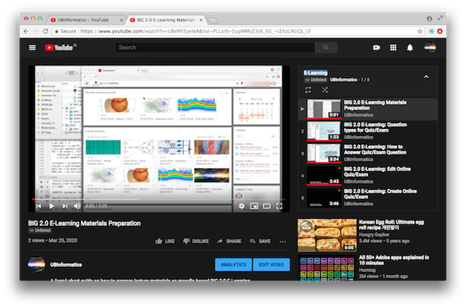

# WFH
Daily activities log during WFH period.

_Notes: dokumen pendukung (screenshots) bisa diakses melalui link yang tersedia pada judul catatan harian masing-masing, atau melalui link pada dokumen lainnya._

### Table of contents:

- Week 1
    - [Day 01 : 2020-03-16 (Mon)](#day-01--2020-03-16-mon)
    - [Day 02 : 2020-03-17 (Tue)](#day-02--2020-03-17-tue)
    - [Day 03 : 2020-03-18 (Wed)](#day-03--2020-03-18-wed)
    - [Day 04 : 2020-03-19 (Thu)](#day-04--2020-03-19-thu)
    - [Day 05 : 2020-03-20 (Fri)](#day-05--2020-03-20-fri)
    - [Day 06 : 2020-03-21 (Sat)](#day-06--2020-03-21-sat)
    - [Day 07 : 2020-03-22 (Sun)](#day-07--2020-03-22-sun)

- Week 2
    - [Day 08 : 2020-03-23 (Mon)](#day-08--2020-03-23-mon)
    - [Day 09 : 2020-03-24 (Tue)](#day-09--2020-03-24-tue)
    - [Day 10 : 2020-03-25 (Wed)](#day-10--2020-03-25-wed)
    - [Day 11 : 2020-03-26 (Thu)](#day-11--2020-03-26-thu)
    - [Day 12 : 2020-03-27 (Fri)](#day-12--2020-03-27-fri)

## [Day 01 : 2020-03-16 (Mon)](https://github.com/ipguna/WFH/tree/master/log/2020-03-16)

### Aktivitas

- Persiapan materi perkuliahan Kalkulus 2 (jadwal reguler 07:30-09.00)
- Persiapan materi perkuliahan Matematika Diskret (jadwal reguler 10.00-12.40)
- Penulisan [dokumen panduan](https://github.com/ipguna/TIF-RPS2020/blob/master/Teaching_Supervision_Guide_01.pdf) perkuliahan secara daring untuk mahasiswa

### Dokumen: 

- [Screenshot aktivitas](https://github.com/ipguna/WFH/tree/master/log/2020-03-16)

### Persiapan materi perkuliahan

- Pembuatan dan upload slide materi ke elearning moodle BIG 2.0
- Penyajian tugas/latihan online
- Setting up chat online dan forum diskusi pada Moodle di BIG 2.0.

## [Day 02 : 2020-03-17 (Tue)](https://github.com/ipguna/WFH/tree/master/log/2020-03-17)

### Aktivitas

- Persiapan materi perkuliahan DSP (untuk jadwal reguler hari Rabu pkl. 07:30-10.00)
- Update dokumen panduan perkuliahan secara daring untuk mahasiswa
- Komunikasi (ref. email) kepada Kabiro HRD dan Kabiro IT mengenai saran dan masukan petunjuk pelaksanaan pembelajaran daring

### Komunikasi

Pemberian rekomendasi pembuatan panduan perkuliahan daring (Referensi: email to Kabiro HRD dan Kabiro IT)

- Menyediakan page khusus dari domain UB atau sub-page BTI berisi panduan/petunjuk pelaksanaan persiapan dan pelaksanaan pembelajaran daring

- Alternatif penempatan page petunjuk
    + https://bakrie.ac.id/jakun
    + https://www.bakrie.ac.id/en/online-class-preparation/
    + https://www.bakrie.ac.id/en/bti/online-class-preparation/ 

- Saran _to do list_ update [dokumen panduan perkuliahan daring](https://github.com/ipguna/TIF-RPS2020/blob/master/Teaching_Supervision_Guide_01.pdf)

    + Petunjuk cara student menjawab/mensubmit hasil kerjaan/jawaban/tugas mahasiswa. 
    + Petunjuk untuk membuat materi online berbasis ‘Lesson’ pada moodle yang seharusnya menjadi prioritas utama utk dosen tetap UB dengan pertimbangan bahwa kemampuan fasilitas/tools di BIG 2.0 sebenarnya lebih dari cukup untuk kebutuhan online course saat ini. Hanya tinggal bagaimana cara kita bisa memanfaatkannya saja
    + Tambahan: panduan set up _online learning course_ di platform lain selain BIG 2.0 (spt Google classroom, webex, dsb), terutama jika misalnya dosen akan mengadakan kelas berbasis conference (Skenario 3 - Advanced). 

Contoh panduan platform non-BIG 2.0: 

- Panduan membuat materi via Webex: https://drive.google.com/file/d/1A3TbXG4MNXbNhMIHS9eyXxGLWcDP2o7l/view?usp=sharing
- Panduan conference menggunakan Jitsi Meet:  https://www.youtube.com/watch?v=6pJRWI9eZgo
- Panduan Google Classroom / Google Hangout: https://www.youtube.com/watch?v=ZeACf_Slsb8

### Dokumen

- [Screenshot aktivitas](https://github.com/ipguna/WFH/tree/master/log/2020-03-17)

## [Day 03 : 2020-03-18 (Wed)](https://github.com/ipguna/WFH/tree/master/log/2020-03-18)

### Aktivitas

- Update dokumen panduan perkuliahan secara daring untuk mahasiswa
- Explorasi - simulasi penyebaran pasien nCovid-19 menggunakan python

    Source code dan hasil simulasi bisa dilihat pada https://github.com/ipguna/CV19
    
    Explorasi simulasi ini dilakukan karena berdasarkan rujukan paper yang digunakan \[1\], model matematika penyebaran kasus nCovid-19 ini merupakan solusi dari persamaan diferensial orde pertama. Akan dilihat apakah persamaan matematika pada kasus ini bisa diterapkan untuk materi kuliah Kalkulus 2.

    Referensi:

    \[1\]. Nuraini, Nuning and Khairudin, Kamal and Apri, Mochamad. "Data dan Simulasi COVID-19 dipandang dari Pendekatan Model Matematika". Preprint. (Submitted) http://eprints.itb.ac.id/119/

### Dokumen

- [Screenshot aktivitas](https://github.com/ipguna/WFH/tree/master/log/2020-03-18)

## [Day 04 : 2020-03-19 (Thu)](https://github.com/ipguna/WFH/tree/master/log/2020-03-19)

### Aktivitas

- Penyajian online materi perkuliahan Komunikasi Nirkabel (untuk jadwal reguler hari Kamis pkl. 10.10-12.40 WIB)
- Update dokumen panduan perkuliahan secara daring untuk mahasiswa
- Continued: simulasi model matematika penyebaran kasus Covid-19 dengan python
    +   Tampilan results hasil simulasi pada console/terminal
    +   TODO: menyimpan results hasil simulasi dalam bentuk datafile dengan format csv
    +   TODO: otomatisasi pembacaan/parsing data mentah dari web \[DONE - Updated [Day 05 : 2020-03-20 (Fri)](#day-05--2020-03-20-fri)\]

### Dokumen

- [Screenshot aktivitas](https://github.com/ipguna/WFH/tree/master/log/2020-03-19)

## [Day 05 : 2020-03-20 (Fri)](https://github.com/ipguna/WFH/tree/master/log/2020-03-20)

### Aktivitas

- Update dokumen RPS (_still in progress_)
- Continued: simulasi model matematika penyebaran kasus Covid-19 dengan python
    +   [Otomatisasi](#parsing-data-mentah-dari-google-spreadsheet) pembacaan/parsing data mentah dari web
    +   [Integrasi](#integrasi-data-untuk-simulasi) data mentah dari Google spreadsheet ke dalam simulasi
    <!-- +   Penambahan [timestamp](#penambahan-timestamp) pada file data yang disimpan -->

### Parsing data mentah dari Google spreadsheet

Cara/metode parsing data Google spreadsheet menggunakan API
(_application program interface_) berbasis python:

- Referensi

    https://medium.com/analytics-vidhya/how-to-read-and-write-data-to-google-spreadsheet-using-python-ebf54d51a72c

- Data CORVID-19 (dari Google Sheet)

    Google sheet URL
    https://docs.google.com/spreadsheets/u/1/d/1ma1T9hWbec1pXlwZ89WakRk-OfVUQZsOCFl4FwZxzVw/htmlview?usp=sharing#

- Google Sheet ID:

        1ma1T9hWbec1pXlwZ89WakRk-OfVUQZsOCFl4FwZxzVw

- Mengaktifkan (_enable_) Google sheet API.

    https://developers.google.com/sheets/api/quickstart/python

    + Aktivasi Google Sheet API (mengeklik button 'Enable the Google Sheet API')

    + Client ID

            789169786057-6fu0hma68l17bf2rs3nt5h5g8sg9e3jf.apps.googleusercontent.com

    + Client Secret

            g2L5B_KNTtDut7pBfh-8a3P5

- Result : error pada saat compile program testing

        pkg_resources.ContextualVersionConflict: (requests 2.14.2
        (/Users/irwan/anaconda/lib/python3.5/site-packages),
        Requirement.parse('requests<3.0.0dev,>=2.18.0'), {'google-api-core'})

    Error ini terjadi karena ternyata pada saat pertama kali dicompile, dibutuhkan
    proses authentikasi ke Google API. Setelah dilakukan proses authentikasi ini,
    maka proses pembacaan data mentah secara langsung ke object data DataFrame
    bisa dilakukan dengan sukses.

- Python code untuk proses testing pembacaan data

        cv19gtest.py

    Code ini diambil sepenuhnya dari referensi metode parsing di atas,
    dengan mengubah parameter-parameter Sheet ID, range cell dan json file
    sesuai dengan yang dibutuhkan.

### Integrasi data untuk simulasi

Dari proses yang sudah dilakukan di atas, data mentah dari Google
spreadsheet telah berhasil dibaca dan disimpan dalam object DataFrame.
Langkah berikutnya adalah membaca / menggunakan data ini dalam proses
simulasi matematis dan visualisasi berikutnya.

#### Metode

Ada beberapa alternatif metode yang bisa dilakukan:

1. **Cara 1:** Menyalin secara langsung data dari DataFrame yang sudah dibaca ke dalam
dataframe yang baru; untuk melakukan hal ini, ada beberapa hal yang mesti
dilakukan:
    - Mengetahui nama field/kolom dari spreadsheet
    - Mengubah nama field/kolom
    - Menyimpan/menyalin data kedalam dataframe baru (dengan proses clean up data)

    Ketiga langkah ini perlu dilakukan agar data yang sudah di-_clean up_ ini
siap dibaca untuk langkah berikutnya (simulasi matematis dan visualisasi
hasil).

2. **Cara 2:** Menyimpan data dari DataFrame yang sudah dibaca ke dalam file CSV, kemudian
membaca kembali file CSV yang dibuat tersebut.

    Metode kedua ini cukup _feasible_ untuk ditempuh karena pada simulasi
    pertama yang sudah dilakukan, data dibaca dari file CSV yang disimpan secara lokal.

    _Obvious disadvantage_ dari **Cara 2** ini adalah extra _processing delay_
    karena penulisan dan pembacaan data dari file CSV.

#### Hasil Pengetesan Integrasi Data

Karena simulasi pertama pada source code `cv19sim.py` menggunakan file
CSV, maka akan dicoba terlebih dahulu **Cara 2**. Pada simulasi yang
telah dilakukan pertama kali, pembacaan data CSV memanfaatkan tools/library
`pandas`. Penulisan data dari DataFrame ke CSV file juga akan memanfaatkan
library yang sama.

Pada proses pembacaan data yang dilakukan oleh `cv19gtest.py`, dataframe
dibentuk oleh

    df=pd.DataFrame(values_input[1:], columns=values_input[0])

Maka selanjutnya, tabel pada DataFrame ini bisa langsung disimpan ke dalam
CSV file dengan code berikut:

    df.to_csv('saved_data.csv')

Referensi: https://realpython.com/python-csv/

Pengetesan integrasi data dengan **Cara 2** ini berhasil dilakukan; data
yang dibaca langsung dari Google Spreadsheet bisa disimpan sebagai CSV file
dan file CSV inilah yang kemudian digunakan oleh program simulasi model
matematik yang sudah ada sebelumnya. Oleh karena itu, untuk sementara waktu
metode / **Cara 2** inilah yang akan dilakukan untuk simulasi-simulasi
berikutnya.

<!-- --------------------------------------------------------- -->

## Day 06 : 2020-03-21 (Sat)

### Aktivitas

- Continued: simulasi model matematika penyebaran kasus Covid-19 dengan python
berupa penambahan fitur [timestamp](#penambahan-timestamp) pada file data yang disimpan.

### Penambahan timestamp

Penambahan timestamp untuk menandai kapan data mentah didownload (dan disimpan)
agar bisa dibedakan dengan versi data yang sama namun didownload pada waktu yang
berbeda.

Referensi yang digunakan:
https://thispointer.com/python-how-to-get-current-date-and-time-or-timestamp/

Untuk keperluan ini, kita gunakan modul python `datetime` yang memiliki _class_ `datetime`.
Waktu pada saat ini diambil dengan metode `now()`.

Sebelumnya pengambilan data waktu ini dilakukan, kita harus terlebih dahulu
melakukan _import class_ `datetime` dari modul `datetime` sebagai berikut:

    from datetime import datetime

Berikutnya adalah mengambil data waktu saat ini pada _local timezone_:

    dateTimeObj = datetime.now()

Selanjutnya, timestamp yang kita inginkan bisa kita bentuk dengan mengubah
object data waktu yang di dapat menjadi _string_ dengan format sesuai kebutuhan:

    timestampStr = dateTimeObj.strftime("%Y_%m_%d_%H%M%S_%f")

Contoh dari format string di atas adalah sebagai berikut:

    >>> print('Current Timestamp : ', timestampStr)
    Current Timestamp :  2020_03_20_141917_887500

Timestamp dalam bentuk string inilah yang akan kita tambahkan ke dalam
    nama file data harian yang diambil dari Google spreadsheet. Misalnya
    dengan cara sebagai berikut:

    basename = 'daily_'
    filetype = '.csv'
    filename = basename + timestampStr + filetype

<!-- --------------------------------------------------------- -->

## Day 07 : 2020-03-22 (Sun)

### Aktivitas

- Eksplorasi beberapa platform e-learning yang digunakan oleh beberapa kampus di Indonesia.
- Persiapan materi perkuliahan

### E-learning kampus

- UAD: https://elearning.uad.ac.id/
     + [Pedoman Elearning bagi Pengampu](https://elearning.uad.ac.id/mod/resource/view.php?id=2746)
     + [Pedoman Elearning bagi Mahasiswa](https://elearning.uad.ac.id/mod/resource/view.php?id=3414)
- STKIP Panca Sakti: https://e-learning.panca-sakti.ac.id/
- UNS: https://ocw.uns.ac.id/site/index
- ITB: https://kuliah.itb.ac.id/portal/

Yang cukup menarik adalah platform e-learning yang digunakan oleh UAD karena menggunakan moodle seperti halnya UB; perbedaannya, versi moodle yang digunakan oleh UB lebih up-to-date. Ini bisa dilihat dari dokumen panduan e-learning yang disediakan.

Sebagai catatan tambahan, akses e-learning di atas melalui operator Telkomsel pada saat ini bebas biaya dengan kuota 30 GB (Layanan Bebas Akses Ilmupedia Telkomsel - https://www.telkomsel.com/paket-ilmupedia).

## [Day 08 : 2020-03-23 (Mon)](https://github.com/ipguna/WFH/tree/master/log/2020-03-23)

### Aktivitas

- Persiapan dan penyajian materi perkuliahan Kalkulus 2 (jadwal reguler 07:30-09.00)
- Persiapan dan penyajian materi perkuliahan Matematika Diskret (jadwal reguler 10.00-12.40)

### Dokumen:

- [Screenshot aktivitas](https://github.com/ipguna/WFH/tree/master/log/2020-03-23)

<!-- --------------------------------------------------------- -->

## [Day 09 : 2020-03-24 (Tue)](https://github.com/ipguna/WFH/tree/master/log/2020-03-24)

### Aktivitas

- Continued: simulasi model matematika penyebaran kasus Covid-19 dengan python menggunakan data kasus seluruh dunia (sumber data JHU/John Hopkins University dan diambil dari https://github.com/CSSEGISandData/COVID-19)

<!-- --------------------------------------------------------- -->

## [Day 10 : 2020-03-25 (Wed)](https://github.com/ipguna/WFH/tree/master/log/2020-03-25)

Tanggal 25 Maret 2020 adalah hari libur nasional (Hari Raya Nyepi) oleh karena itu jadwal kuliah reguler DSP (Rabu, 07.30-10.00) akan diganti dengan jadwal lain yang akan ditentukan kemudian.

### Aktivitas

- Pembuatan video panduan perkuliahan secara daring untuk dosen
- Pembuatan video panduan pengisian tugas/quiz/exam secara daring untuk mahasiswa
- Pembuatan website mengunakan fasilitas Google sites yang nantinya bisa digunakan sebagai portal media diseminasi informasi yang terkait dengan bimbingan, perkuliahan, dan sebagainya

#### Video panduan

Untuk dosen:
- Materials Preparation
- Questions Types for Quiz/Exam
- Create Online Quiz/Exam
- Edit Online Quiz/Exam

Untuk dosen dan mahasiswa:
- How to Answer Quiz/Exam

Semua video panduan ini bisa diakses secara streaming melalui YouTube channel (lihat di [bawah](#pembuatan-video-panduan)). Daftar video panduan juga disimpan dalam portal [website](#website) yang baru dibuat (menggunakan fasilitas Google sites).

#### Pembuatan Video panduan

Pembuatan video panduan menggunakan metode screen capturing yang kemudian diedit menggunakan `Final Cut Pro`. Proses editing melibatkan penambahan anotasi dan ilustrasi musik. Selanjutnya, video yang sudah selesai diupload ke YouTube channel.

Proses editing lanjutan bisa dilakukan pada `YouTube Studio`; misalnya, penambahan localized blur pada sebagian area video yang dianggap sensitif.

Video panduan diupload ke YouTube channel

> [https://www.youtube.com/channel/UCs9gXUFopoPrUWMLCdXD9FQ](https://www.youtube.com/channel/UCs9gXUFopoPrUWMLCdXD9FQ)

dan disimpan ke dalam playlist 'E-Learning'

> https://www.youtube.com/playlist?list=PLLzrb-0ugMMyZ3sX_60_-LEhzLNUQL_I3

Semua video panduan ini diset sebagai `private video` sehingga tidak akan tercantum pada laman YouTube; hanya user yang memiliki link-nya yang dapat mengakses video-video ini.

#### Website

Pembuatan website yang bisa digunakan sebagai portal media diseminasi informasi yang terkait dengan bimbingan, perkuliahan, penelitian, dan sebagainya. Link website:

> https://sites.google.com/view/ubipguna/

Tampilan proses editing website pada halaman utama:

Daftar video panduan bisa diakses melalui laman
>https://sites.google.com/view/ubipguna/e-learning

Tampilan proses editing halaman e-learning pada website:

<!-- --------------------------------------------------------- -->

## [Day 11 : 2020-03-26 (Thu)](https://github.com/ipguna/WFH/tree/master/log/2020-03-26)

### Aktivitas

- Persiapan dan penyajian materi perkuliahan Komunikasi Nirkabel (jadwal reguler 10.00-12.40)

## [Day 12 : 2020-03-27 (Fri)](https://github.com/ipguna/WFH/tree/master/log/2020-03-27)

### Aktivitas

- Pembuatan laman sosialisasi mengenai `coronavirus` yang bisa disebarkan kepada mahasiswa atau sivitas akademika UB

### Laman sosialisasi corona virus

Laman sosialisasi pandemic corona virus bisa diakses di
> https://sites.google.com/view/ubipguna/cv19

Tampilan:

<!--

# TODO: Penambahan fitur menyimpan results dalam csv file dan menyimpan konfigurasi simulasi dalam file teks

# TODO: Updata data global https://github.com/CSSEGISandData/COVID-19

 -->

# Todo List
* [x] Otomatisasi pembacaan/parsing data mentah dari web \[DONE - Updated [Day 05 : 2020-03-20 (Fri)](#day-05--2020-03-20-fri)\]
* [ ] Simulasi menggunakan data worlwide
* [x] Menyimpan results hasil simulasi dalam bentuk datafile dengan format CSV
* [x] Menyimpan konfigurasi simulasi dalam file tersendiri
* [X] RPS Update - DSP \[DONE\]
* [x] RPS Update - Calculus 2 \[REVISED\]
* [ ] RPS Update - Discrete Mathematics \[IN PROGRESS\]
* [ ] RPS Update - Wireless Communications

